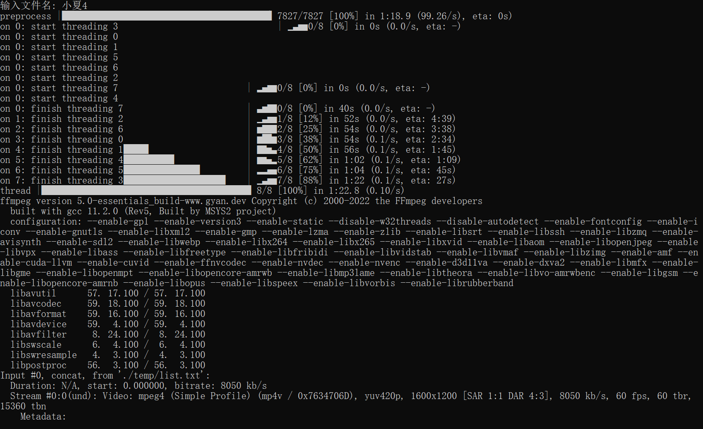
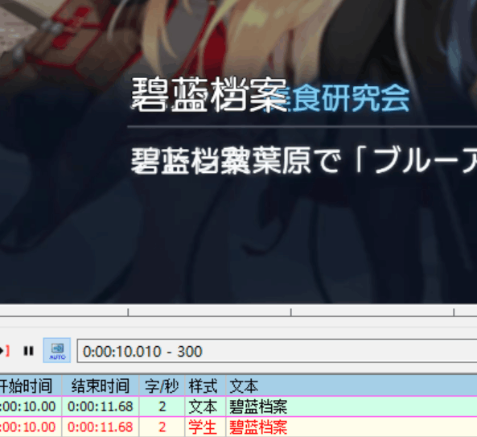
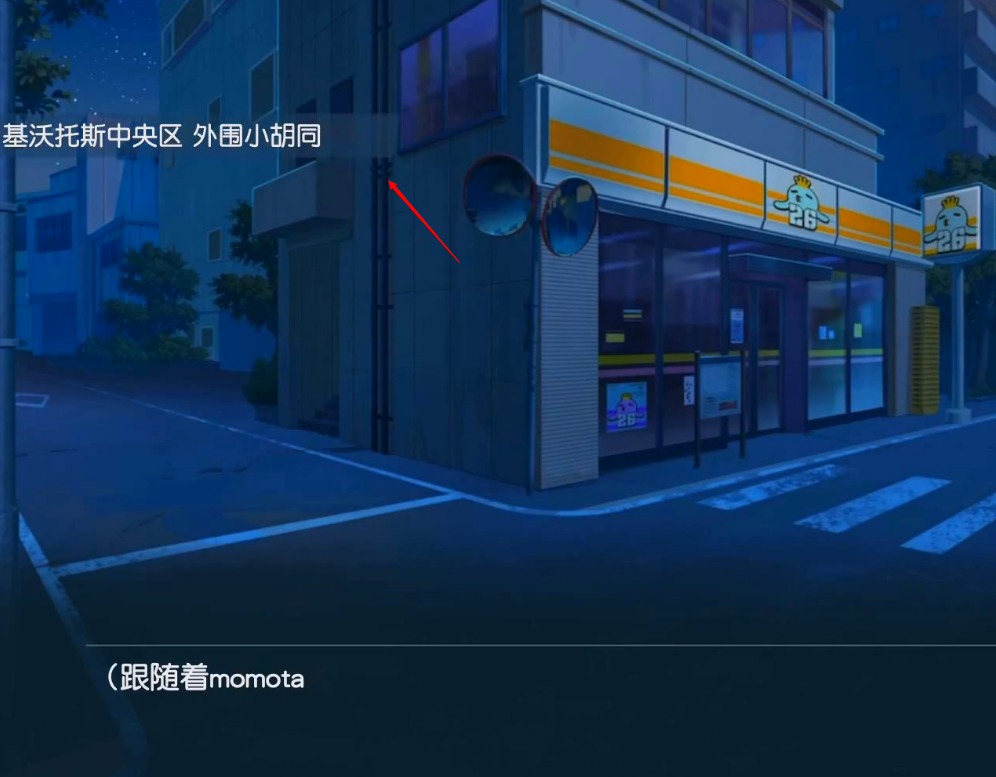
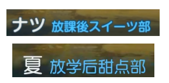

# Blue_Archive_Timestamper

碧蓝档案剧情烤肉工具

- [Part1 去除文字 📜](#part1-%E5%8E%BB%E9%99%A4%E6%96%87%E5%AD%97-)
    - [使用](#%E4%BD%BF%E7%94%A8)
    - [关于打轴](#%E5%85%B3%E4%BA%8E%E6%89%93%E8%BD%B4)
        - [第一帧](#%E7%AC%AC%E4%B8%80%E5%B8%A7)
        - [最后一帧](#%E6%9C%80%E5%90%8E%E4%B8%80%E5%B8%A7)
        - [样式选择](#%E6%A0%B7%E5%BC%8F%E9%80%89%E6%8B%A9)
    - [其他](#%E5%85%B6%E4%BB%96)
    - [依赖包：](#%E4%BE%9D%E8%B5%96%E5%8C%85)
    - [当前进度：](#%E5%BD%93%E5%89%8D%E8%BF%9B%E5%BA%A6)
        - [todo](#todo)
        - [更新 22/1/25](#%E6%9B%B4%E6%96%B0-22125)
        - [更新 22/1/24](#%E6%9B%B4%E6%96%B0-22124)
        - [更新 22/1/23](#%E6%9B%B4%E6%96%B0-22123)
- [Part2 自动打轴🤖](#part2-%E8%87%AA%E5%8A%A8%E6%89%93%E8%BD%B4)
    - [使用](#%E4%BD%BF%E7%94%A8)
        - [剧情打轴](#%E5%89%A7%E6%83%85%E6%89%93%E8%BD%B4)
        - [阿罗娜频道打轴](#%E9%98%BF%E7%BD%97%E5%A8%9C%E9%A2%91%E9%81%93%E6%89%93%E8%BD%B4)
    - [依赖库](#%E4%BE%9D%E8%B5%96%E5%BA%93)
    - [当前进度](#%E5%BD%93%E5%89%8D%E8%BF%9B%E5%BA%A6)
        - [更新 22/1/27](#%E6%9B%B4%E6%96%B0-22127)
        - [更新 22/1/26](#%E6%9B%B4%E6%96%B0-22126)

# Part1 去除文字 📜

## 使用

1. 将 `ffmpeg.exe` 放在 `C:/Windows`

2. `aegisub` 打开 `样式.ass`，新建样式库目录保存当前脚本的样式

3. 打轴

4. 确认时轴和视频同名，并都与 `demo.exe` 、 `config.txt` 同级目录

5. 运行 `demo.exe`，输入视频名（不带扩展名），等待结束即可




## 关于打轴

### 第一帧

对于对话框中的文字，「第一帧」比「第一个字符出现的帧」要提前一点，可以视「学生名字出现/变化的帧」为第一帧

### 最后一帧

对于淡出的画面，「最后一帧」是「文字完全消失的帧」

### 样式选择

填轴的时候不需要写代码特效 如 `\fad` `\pos`

（如果需要调整字幕位置请直接修改样式 或者 参考最后一行）

| 内容                               | 样式             | 格式               |
| ---------------------------------- | ---------------- | ------------------ |
| 章节                               | 章节             | 无                 |
| 标题                               | 标题/羁绊标题    | 无                 |
| 旁白                               | 文本             | 无                 |
| 学生说话                           | 文本             | 学生（社团）：文本 |
| ※淡出转场的旁白或者学生说话        | 文本-fadeout     | 同上               |
| ※字体较大的旁白或者学生说话        | 大文本           | 同上               |
| 单选项                             | 单选             | “文本”             |
| 多选项                             | 选项1、选项2     | “文本”             |
| 地点                               | 地点             | 无                 |
| \*其他特殊的内容或需要使用代码特效 | 〔新建一个样式〕 | 〔根据需要〕       |

## 其他

📌如果字体有问题可以安装「华康圆体W7(P)」和「华康圆体W9(P)」，或者使用自己的字体并调整样式

- 使用自己的字体，样式最终效果保证文字和原文大小位置完全对齐即可
- ❗ 使用自己的字体一定需要调整「学生」

📌提供的样式基于 1600*1200 的视频，如果有对不齐的情况，请调整样式和 config.txt

- config.txt 是根据样式名确定的打码区域，可以用标尺确定需要填写的数值，建议区域比字本身大一点
- 样式通过样式管理器调整，最终效果保证文字和原文大小位置完全对齐即可
- ❗ 一定需要调整「学生」的样式和config，调整方式一样



📌打字机效果方案

- 打开 [在线python](https://www.runoob.com/try/runcode.php?filename=HelloWorld&type=python3)

- ```
    text = "这里是文本"
    cnt = 1
    s = ""
    for word in text:
    	s = s+"{\\1a&HFF&\\3a&HFF&\\4a&HFF&}{\\t("+str(cnt*33)+","+str(cnt*33+1)+",\\1a&H00&\\3a&H00&\\4a&H00&)}"+word
    	if cnt % 35 == 0: # 每行 35 字
    		s += "\\N{\\fs 0}\\N"
    	cnt=cnt+1
    print(repr(s))
    ```

- 修改「这里是文本」，运行后填入 aegisub 即可

## 依赖包：

`opencv`

[OPENCV2 图像修复 — 去除文字（下）_learn_sunzhuli的专栏-CSDN博客](https://blog.csdn.net/learn_sunzhuli/article/details/47791519)

[Python-OpenCV中的cv2.inpaint()函数 - Rogn - 博客园 (cnblogs.com)](https://www.cnblogs.com/lfri/p/10618417.html)

`pysubs2`

[python 提取字幕_使用 Python 提取字幕文件_weixin_39830906的博客-CSDN博客](https://blog.csdn.net/weixin_39830906/article/details/110778737)

`alive_progress`

[酷炫的 Python 进度条开源库：alive-progress-技术圈 (proginn.com)](https://jishuin.proginn.com/p/763bfbd55bf8)

## 当前进度：

- [x] openCV-inpaint 实现单张图片去除文字
- [x] pysubs2 处理字幕标记时间轴
- [x] 视频去除文字并输出
- [x] 字幕样式
- [x] 多线程
- [x] 声音
- [x] 字幕视频压制
- [x] 字幕文本换行
- [x] 进度条
- [x] 字幕打字机效果
- [x] 地点字幕样式
- [x] 渐变过场画面修补效果优化
- [x] 字幕样式优化
- [x] 打包可执行文件
- [x] 地点渐变修补优化

目前效果：


### todo

- 三选项字幕样式
- 预处理优化

### 更新 22/1/25

- 优化渐变过场画面

- 修复相对路径错误 ❗

- 打包可执行文件 🗹

- 字幕样式优化

### 更新 22/1/24

- 添加字幕打字机效果 🌟

- 添加地点字幕样式 🏘



- 渐变过场画面修补效果优化

- 字幕样式优化

### 更新 22/1/23

- 添加学生名和社团样式 ☁



- 添加多线程 🌠

测试视频用时 （预处理用时+修复用时）

（时长：2m10s）11m 5.7s → 2m 20.4s + 2m 53.3s

同时切分合并预处理减小文件体积 

135 MB → 26.2 MB

153 MB → 40.1 MB

- 合并原视频音轨 ♪

- ffmpeg 硬字幕压制

- 添加 alive-progress 进度条 


- 字幕文本实现换行

# Part2 自动打轴🤖

## 使用

### 剧情打轴

未完成

### 阿罗娜频道打轴

准备 `视频.mp4` 和 `翻译文本.txt`

运行 `阿罗娜打轴机.py`

## 依赖库

`OpenCV`

`alive_progress`

`pysubs2`

## 当前进度

### 更新 22/1/27

- [x] 更换算法 参考 : [基于图像识别和文字识别用 Python 提取视频字幕](https://blog.csdn.net/XnCSD/article/details/89376477)
- [x] 符号识别
- [x] 开头空白时间戳
- [x] 阿洛娜频道打轴
- [ ] 选项、标题打轴
- [ ] 渐变转场优化

### 更新 22/1/26

- [x] OCR 打轴（PaddleOCR）
- [ ] 开头空白时间戳
- [ ] 开头符号无法识别
- [ ] 选项打轴
- [ ] 多线程