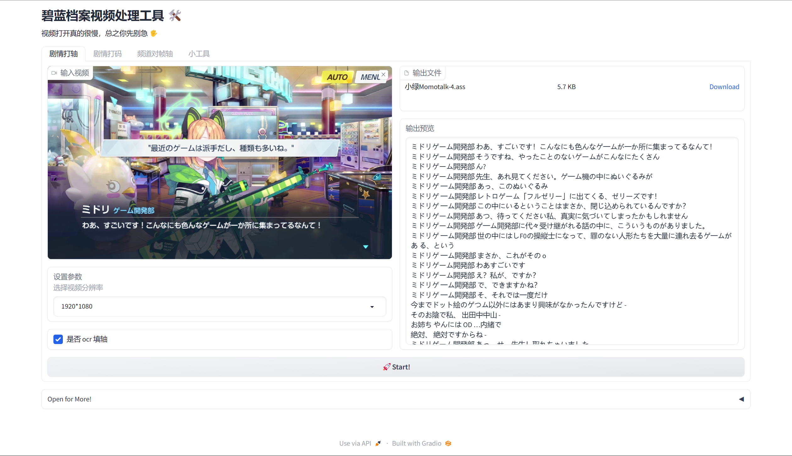
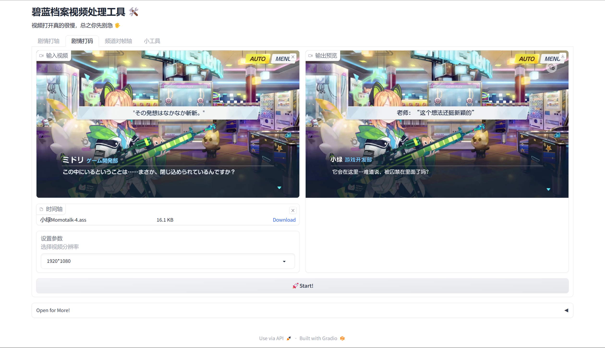
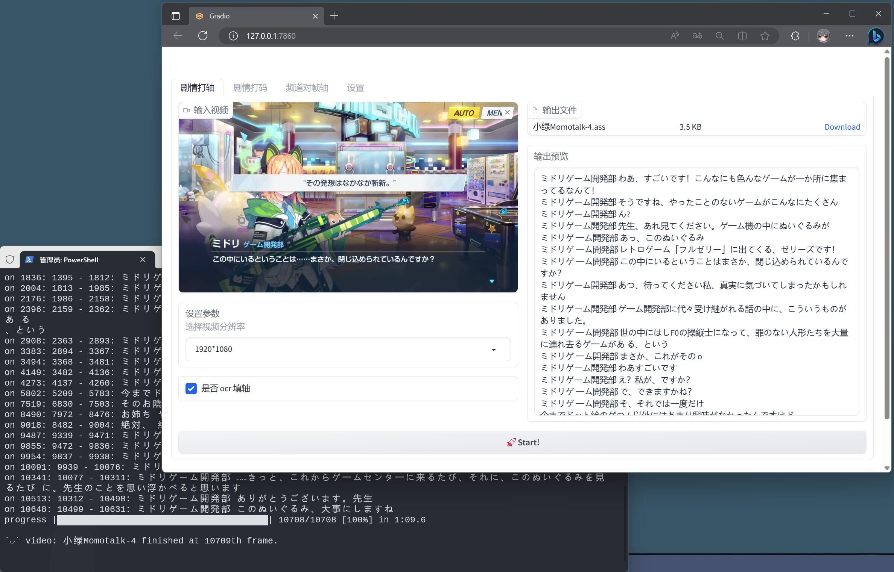
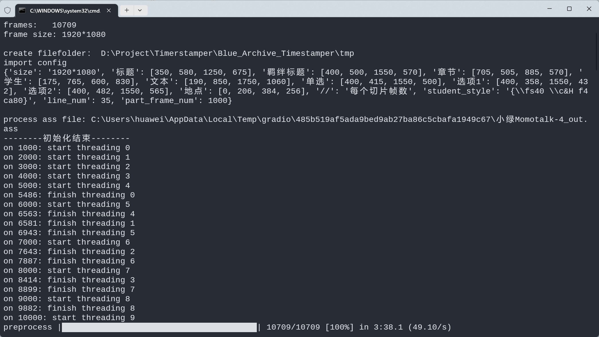
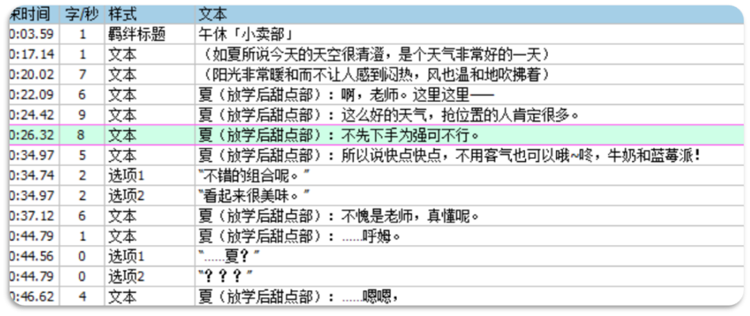
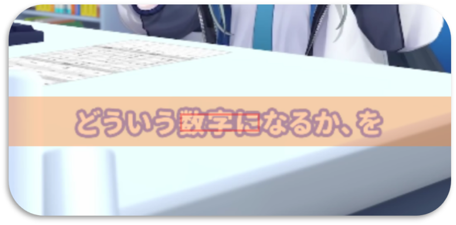
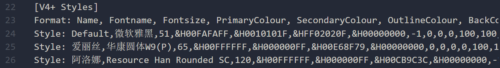

<h1 align="center">碧蓝档案视频烤肉工具</h1>

<div align="center">
  <a href="https://github.com/u1805/Subaligner/releases/latest">
    
  </a>
  <a href="License">
    
  </a>
  <a href="#下载">
    
  </a>
  <a href="https://star-history.com/#u1805/Subaligner">
    
  </a>
</div>


<div align="center">
  <strong>基于 OCR 和 Opencv 的视频对帧轴&消除文字工具</strong><br>
  <sub>适用于游戏剧情汉化</sub>
</div>

<div align="center">
  <h3>
    <a href="#说明目录">
      使用说明
    </a>
    <span> • </span>
    <a href="#下载">
      下载地址
    </a>
    <span> • </span>
    <a href="#更新日志">
      更新日志
    </a>
    <span> • </span>
    <a href="https://github.com/u1805/Blue_Archive_Timerstamper/issues">
      提交Bug
    </a>
  </h3>
</div>

- **方便**：解压即用免安装，新增 UI 界面便于操作
- **离线**：文字识别离线运行，没网也能干活

## 说明目录

- [快速上手](#快速上手) 简单体验一下效果
- [进阶设置](#编辑设置文件) 添加更多自定义的设置参数

## 看看效果

<table><tr>
<td> </td border=0>
<td> </td border=0>
</tr>
<tr>
<td> </td border=0>
<td></td border=0>
</tr>
<tr>
<td colspan="2"><center></center></td border=0>
</tr></table>


## 下载

[Release v1.2.1](https://github.com/u1805/Blue_Archive_Timerstamper/releases/tag/v1.2.1)

## 快速上手

下载解压后双击 `A启动器.bat` 运行

> 第一次运行可能需要等待一段时间，配置运行需要的环境

在出现 `Running on local URL:  http://127.0.0.1:7860` 字样后，浏览器打开 http://127.0.0.1:7860

界面上方有选项卡可以选择对应功能
- **剧情打轴**，因为剧情的打轴规则和普通对帧轴有些许不同，所以单独提出来了
- **剧情打码**，在 Aegisub 中完成翻译并时轴后消除原视频文字顺便压字幕
- **频道打轴**，普通的视频对帧轴工作基本都能做到
- **小工具**，包括视频下载、字幕压制、视频格式转换和打字机效果代码生成

主界面分为左右两部分，左面输入右边输出，按界面提示操作连小春都会用

### 自动打轴 🤖

1. 自动打轴目前仅实现文本样式的打轴，且结果仅能作为参考。请自行校对结果，尤其是 fadeout 和断轴处
2. 取消勾选 `使用ocr`，生成字幕文件中为空轴
3. 选项的打轴在做了在做了（

### 去除文字 📜



<center>时轴样例</center>

#### 第一帧和最后一帧

对于对话框中的文字，「第一帧」比「第一个字符出现的帧」要提前几帧，可以视「**学生名字出现/变化的帧**」为第一帧

对于淡出的画面，「最后一帧」是「**文字完全消失的帧**」

#### 样式选择

填轴的时候不需要写代码特效 如 `\fad` `\pos`

（如果需要调整字幕位置请直接修改样式 或者 参考最后一行）

| 选择样式              | 内容             | 格式               |
| -------------------- | ---------------- | ------------------ |
| 章节                  | 章节             | 无                 |
| 标题/羁绊标题          | 标题             | 无                 |
| 文本                  | 旁白             | 无                 |
| 文本                  | 学生说话          | 学生（社团）：文本 |
| 文本-fadeout          | ※淡出转场的文本框内容 | 同上           |
| 大文本                | ※字体较大的文本框内容 | 同上           |
| 单选                  | 单选项             | “文本”             |
| 选项1、选项2          | 多选项           | “文本”             |
| 地点                  | 地点             | 无                 |
| 〔新建一个样式〕       | \*其他特殊的内容或需要使用代码特效  | 〔根据需要〕       |

新建的样式没有打字机的效果可以在 `小工具→打字机效果` 中添加

新建的样式名最好不要包括已有的样式名，像是 `文本A`

## 编辑设置文件

### config.json

首先简单说说频道打轴的原理：
程序开始运行后读取对应的运行参数，然后逐帧读取设定的识别区域，检测到有文字变化，就记录开始时间点，当检测到再次变化时记录结束时间点，打下一个时轴。

具体来说，识别区域定位是字幕约中间三个字的位置，如图红框处，一来为了提高识别速度，二来可以一定程度上减少字幕下画面变化的干扰。

而打下时轴时，可以识别橙框区域文字作为时轴内容，方便检查对帧。

<center></center>

明白原理后可以开始设置参数了，用记事本打开 `modules/config.json` 拉到最下面，内容如下：

```json
{
    "频道打轴":{
        "阿罗娜":[
            {
                "size": "1280*720",
                "text": [560,614,725,710],
                "text_area": [614,710]
            },
            {
                "size": "1920*1080",
                "text": [874,960,1077,1018],
                "text_area": [930,1070]
            }
        ],
        "爱丽丝":[
            {
                "size": "1080*1920",
                "text": [472,1554,624,1589],
                "text_area": [1524,1650]
            }
        ]
    }
}
```

`text` 字段是上图中红框区域坐标，按左上、右下顺序填入，用于检测文字变化；`text_area` 字段是上图中橙框区域的两个 y 坐标，用于识别文字。试着添加你自己的规则吧！

[json 语法参考](https://www.runoob.com/json/json-syntax.html)

### 字幕样式

默认字体使用「华康圆体W7(P)」和「华康圆体W9(P)」，这里[下载](https://github.com/U1805/Blue_Archive_Timerstamper/releases/download/fonts/fonts.zip)，你也可以用自己的字幕样式（不要忘记调整「学生」样式）

字幕文件 ass 本质上是文本文档，只是可以被特定的工具按规则读取解析。只要你知道规则，理论上甚至不需要 Aegisub 就能纯人肉打轴（bushi）

用记事本打开 `modules/样式.ass` 可以看到有一个 [V4+ Styles] 这里就是设定的样式，图中有 Default、爱丽丝、阿洛娜 三种样式。



打开你的 ass，把你的样式替换过来吧！

## 更新日志

- [ ] 选项、标题样式打轴
- [ ] 渐变转场优化

### 更新 23/6/21
- [x] 格式转MP4工具
- [x] 修复小工具bug

### 更新 23/6/17

- [x] 新增 WebUI 界面，方便操作
- [x] 重构 config.json 结构
- [x] 预设 720P 和 1080P 的参数和样式
- [x] 打码器并行代码优化，不会出现突然 CPU 占用 100% 的现象了
- [x] 增加视频下载工具和字幕压制工具

### 更新 23/4/21

- [x] 替换OCR引擎：`easyocr`+`manga-ocr` →  `paddleocr-json`
- [x] 精简安装环境大小（1.65G → 620M）
- [x] 优化项目文件夹结构

### 更新 23/4/14

- [x] 阿罗娜频道打轴
- [x] 打轴机 ocr 双线程处理
- [x] 命令行参数运行
- [x] 修复已知错误
- [x] 打字机效果工具

### 更新 23/4/12

- 对文件路径处理优化
- 实现 OCR 自动文本区域的打轴
- 优化打轴器代码逻辑，实现剧情打轴
- 分离大量自定义参数
- 弃用 `pysub2` 相关函数，提高对帧轴精度
- 参考 Stable Diffusion Webui 启动方案

### 更新 22/1/27 - autosub

- [x] 更换算法 [参考](https://blog.csdn.net/XnCSD/article/details/89376477)
- [x] 开头符号无法识别 bug 修复
- [x] 开头空白时间戳修复
- [x] 阿洛娜频道打轴

### 更新 22/1/26 - autosub

- [x] OCR 打轴（PaddleOCR）

### 更新 22/1/25 - inpaint

- 视频声音修复
- 优化渐变过场画面
- 修复相对路径错误 ❗
- 打包可执行文件 
- 字幕样式优化

### 更新 22/1/24 - inpaint

- 添加字幕打字机效果 🌟
- 添加地点字幕样式 🏘
- 渐变过场画面修补效果优化
- 字幕样式优化

### 更新 22/1/23 - inpaint

- pysubs2 处理字幕标记时间轴
- 视频去除文字并输出
- 字幕打字机效果
- 添加学生名和社团样式 ☁
- 添加多线程 🌠
- 合并原视频音轨 ♪
- ffmpeg 硬字幕压制
- 添加 alive-progress 进度条 
- 字幕文本实现换行

## 参考文章

[酷炫的 Python 进度条开源库：alive-progress](https://jishuin.proginn.com/p/763bfbd55bf8)

[OPENCV2 图像修复 — 去除文字（下）](https://blog.csdn.net/learn_sunzhuli/article/details/47791519)

[Python-OpenCV中的cv2.inpaint()函数](https://www.cnblogs.com/lfri/p/10618417.html)

## 感谢

[gradio-app/gradio](https://github.com/gradio-app/gradio)
> Create UIs for your machine learning model in Python in 3 minutes

[opencv/opencv-python](https://github.com/opencv/opencv-python)
> Automated CI toolchain to produce precompiled opencv-python

[rsalmei/alive-progress](https://github.com/rsalmei/alive-progress)
> A new kind of Progress Bar, with real-time throughput, ETA, and very cool animations!

[hiroi-sora/PaddleOCR-json](https://github.com/hiroi-sora/PaddleOCR-json)
> OCR离线图片文字识别命令行windows程序，以JSON字符串形式输出结果，方便别的程序调用。提供各种语言API。由 PaddleOCR C++ 编译。

[yt-dlp/yt-dlp](https://github.com/yt-dlp/yt-dlp)
> A youtube-dl fork with additional features and fixes

[FFmpeg/FFmpeg](https://github.com/FFmpeg/FFmpeg)
> FFmpeg is a collection of libraries and tools to process multimedia content such as audio, video, subtitles and related metadata.

## License

[MIT license](https://github.com/kirillmurashov/vue-drag-resize/blob/master/LICENSE)