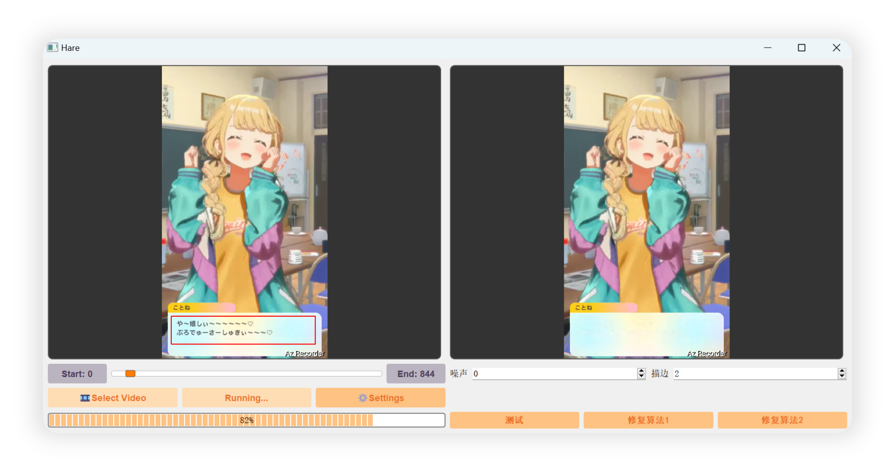
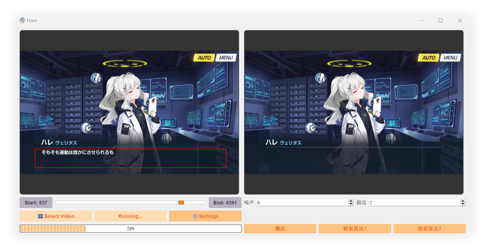

 
 

# 视频文字清除工具

****

“今天，晴会保佑你，不管写什么代码，都不会出现漏洞。” —— 小钩晴 [📢](https://static.kivo.wiki/voices/students/%E5%B0%8F%E9%92%A9%20%E6%99%B4/guF8G61lNHMhqdeztHSHTAMMEmCG1qy1.ogg)

****

此项目基于 OpenCV 和 pyQt5 开发，用于清除游戏剧情录屏中的字幕，方便汉化

## 下载

[release](https://github.com/U1805/Hare/releases/tag/v1.0.0r)

## 效果

## 快速上手

### 第一次尝试

点击 `🎞 Select Video` 选择视频文件

滑动视频下方的拖动条可以预览视频内容，在视频上点击滑动创建消除区域

点击 `🚀 Run` 开始运行。运行结束后，与视频同目录下会出现带后缀 `output` 的结果文件

### 更多设置

第一次运行的效果可能不理想，点击 `⚙️ Setting` 进入更多设置

调整 `噪声` 和 `描边` 两个参数，选择 `测试` 可以查看掩码效果，确保能看到要消除的内容，而不需要消除的内容为黑色

选择 `修复算法` 预览消除效果，其中算法 1 为 opencv 内置的 inpaint 函数，简单且快，算法 2 是 [🦙LaMa](https://github.com/advimman/lama) 模型的修复算法，慢但是效果好

点击 `修复算法` 后，之后运行就是以刚点过的算法进行消除

> 如果消除效果不好，请确认是掩码的问题还是修复的问题，前者可以通过调整参数应对大部分情况（或者提 issue 压力我优化算法），后者如果 Lama 的修复效果也不好的话可以考虑[自己炼个模型](https://github.com/advimman/lama?tab=readme-ov-file#train-and-eval) -> [转成 onnx](./md/export_LaMa_to_onnx.ipynb)

### 区间消除

先已增加对部分视频的文字消除。滑动视频下的拖动条后，点击左右的按钮 `Start/End` 标记开始时间和结束时间

运行时只会处理区间内的视频帧

## TODO

- [x] 竖屏选区问题
- [x] 多线程加速
- [ ] 窗口大小自适应
- [x] 更好的掩码算法（还有图像修复算法）
- [ ] 更更好的掩码算法
- [x] 运行时禁用UI组件
- [x] 导出时合并声音
- [x] 参数持久化
- [ ] 时轴样式（打字机、双语）
- [x] 修复并行没有边处理边写入的问题
- [ ] 方向键控制拖动条（一帧、Shift五帧）

## License

[MIT license](./LICENSE)

## 感谢

- [FFmpeg](http://ffmpeg.org/) - 伟大，无需多言
- [skywind3000/PyStand](https://github.com/skywind3000/PyStand) - 🚀 超方便的 Python 独立部署环境
- [advimman/lama](https://github.com/advimman/lama) - 🦙 基于傅里叶卷积的图像修复
- [Carve-Photos/lama](https://github.com/Carve-Photos/lama) - ONNX 模型的 LaMa
- [U1805/Blue_Archive_Timerstamper](https://github.com/U1805/Hare/tree/main) - 以前烤肉工具的经验（我谢我自己