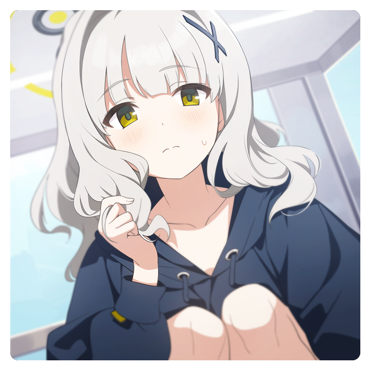

<div align=center></div>

 
 


# 视频文字清除工具

****

“今天，晴会保佑你，不管写什么代码，都不会出现漏洞。” —— 小钩晴 [📢](https://static.kivo.wiki/voices/students/%E5%B0%8F%E9%92%A9%20%E6%99%B4/guF8G61lNHMhqdeztHSHTAMMEmCG1qy1.ogg)

****

此项目基于 OpenCV 和 pyQt5 开发，用于清除游戏剧情录屏中的字幕，方便汉化

## 下载

[release](https://github.com/U1805/Hare/releases/tag/v1.0.1r) <- 从这里下载

下载 `Hare.zip`，解压压缩包后你应该得到下面的文件结构

```
├─runtime
├─site-packages
│   ├─cv2
│   ├─numpy
│   └─PyQt5
├─resources
├─ffmpeg.exe
├─Hare.exe    <- 双击运行
├─Hare.int
└─script.egg
```

## 效果


## 快速上手


## 调试

1. 下载 Python3.8 嵌入式环境，解压获得 `runtime` 目录  
   [Windows x86-64 embeddable zip file](https://www.python.org/downloads/release/python-380/)
2. 获得 Python3.8 对应的依赖
   1. 创建虚拟环境 `\path\to\py38\python.exe venv test`
   2. 进入 Scripts 目录，运行 `activate`
   3. pip 安装依赖 `opencv-contrib-python` `numpy` `PyQt5`
   4. 到 Lib/site-packages 目录复制依赖
3. 新建 `site-packages` 目录，将获得的依赖复制进去
4. 运行 `./Hare.exe` 或者在虚拟环境中 `python ./Hare.int`

## TODO

- [x] 多线程加速
- [ ] 更好的掩码算法
- [ ] 更好的图像修复算法
- [ ] 参数持久化
- [ ] 多区域修复
- [ ] ass时轴导入获取区间

## License

[MIT license](./LICENSE)

## 感谢

- [FFmpeg](http://ffmpeg.org/) - 伟大，无需多言
- [skywind3000/PyStand](https://github.com/skywind3000/PyStand) - 🚀 超方便的 Python 独立部署环境