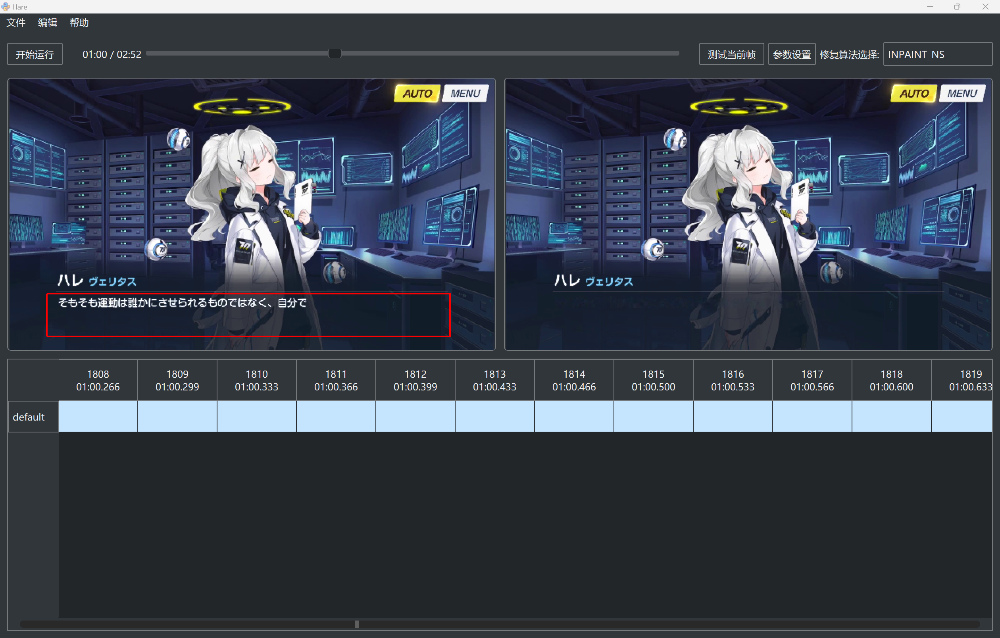
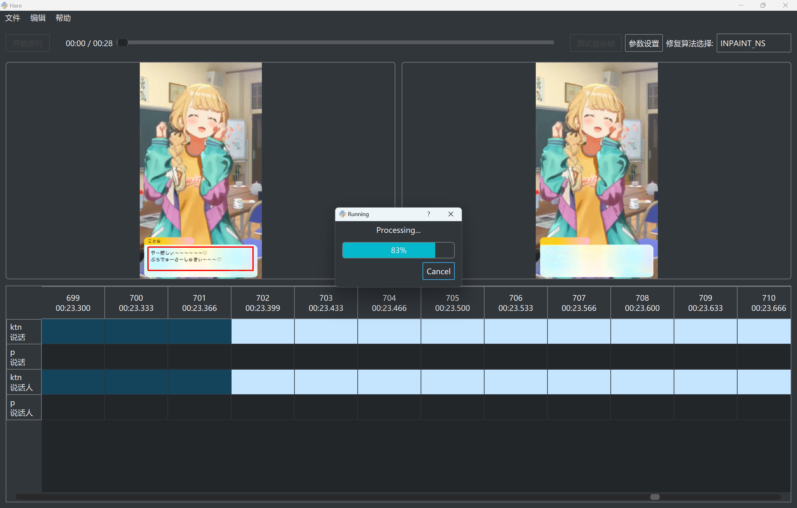
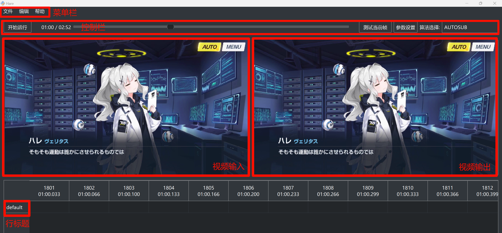

<div align=center></div>

 
 


# 视频文字清除工具

****

“今天，晴会保佑你，不管写什么代码，都不会出现漏洞。” —— 小钩晴 [▶️](https://static.kivo.wiki/voices/students/%E5%B0%8F%E9%92%A9%20%E6%99%B4/guF8G61lNHMhqdeztHSHTAMMEmCG1qy1.ogg)

****

此项目基于 OpenCV 和 pyQt5 开发，用于清除游戏剧情录屏中的字幕，方便汉化

## 下载

[release](https://github.com/U1805/Hare/releases/latest) <- 从这里下载

下载 `Hare.zip`，解压压缩包后你应该得到下面的文件结构

```
Hare
├─runtime
├─site-packages
│   ├─cv2
│   ├─numpy
│   └─PyQt5
├─resources
├─ffmpeg.exe
├─Hare.exe    <- 双击运行
├─Hare.int
└─script.egg
```

## 效果





## 快速上手



1. 加载视频文件
   - 打开文件：菜单栏的 `文件` -> `选择视频`
   - 预览视频：滑动控制栏的进度条预览视频内容
2. 加载时轴文件
   - 打开文件：菜单栏的 `文件` -> `选择字幕`
3. 创建修复区域
   - 点击一个行标题
   - 在左侧视频输入区域，按住鼠标左键并拖动
   - 不同的修复区域红框不会同时显示
   - 算法选择 **MASK**，点击 `测试当前帧` 
4. 选择修复算法
   - 算法选择 **INPAINT**，点击 `测试当前帧`
5. 运行修复算法
   - 设置完成后，点击 `开始运行` 按钮
   - 结果文件在视频同目录，文件名以 output 结尾

## 算法选择
  
- **MASK**：掩码算法，用于测试需要消除的对象，  
请确保有目标文字时掩码完全覆盖，没有文字时无掩码
- **INPAINT**：INPAINT 开头为修复算法，  
不透明/半透明文本框 -> INPAINT_NS (耗时 1.5x)，  
透明文本框静态背景 -> INPAINT_FSR_PARA (耗时 5x)
- **AUTOSUB**：自动打轴算法

> 优先使用 INPAINT_NS

## 自动打轴

1. 加载视频文件
2. 创建修复区域
3. 选择算法：**AUTOSUB**
4. 开始运行

## 其他操作

- 修复灰色文字，需要额外双击行标题选择灰色
- 双击单元格可以改变单元格修复状态

## 调试

1. 下载代码  
`git clone https://github.com/U1805/Hare.git --depth=1`
2. 下载 Python3.8 嵌入式环境，解压获得 `runtime` 目录  
[Windows x86-64 embeddable zip file](https://www.python.org/downloads/release/python-380/)
1. 获得 Python3.8 对应的依赖
   1. 创建虚拟环境 `\path\to\py38\python.exe venv test`
   2. 进入 Scripts 目录，运行 `activate`
   3. pip 安装依赖 `opencv-contrib-python` `numpy` `PyQt5`
   4. 到 Lib/site-packages 目录复制依赖
2. 新建 `site-packages` 目录，将获得的依赖复制进去
3. 运行 `./Hare.exe` 或者在虚拟环境中 `python ./Hare.int`

## TODO

- [ ] 更好的掩码算法
  - [ ] 检测到半透明/渐隐的字
- [ ] 更好的修复算法
  - [x] INPAINT_FSR_FAST
  - [x] INPAINT_FSR_BEST
  - [x] INPAINT_FSR_PARA (并发的FAST,速度约快一倍)

## License

[GNU license](./LICENSE)

## 感谢

- [FFmpeg](http://ffmpeg.org/) - 伟大，无需多言
- [skywind3000/PyStand](https://github.com/skywind3000/PyStand) - 🚀 超方便的 Python 独立部署环境